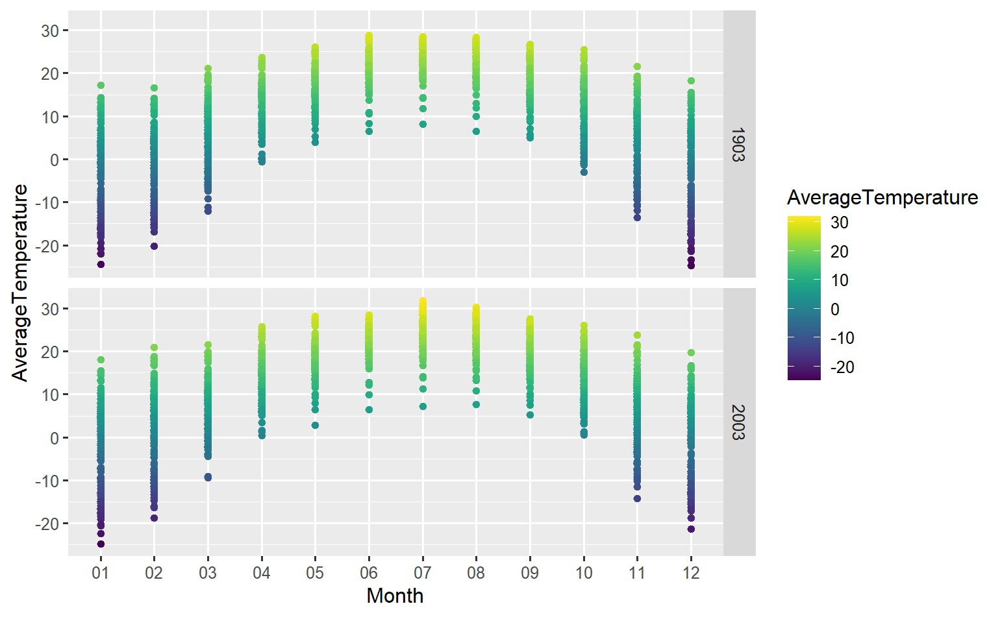
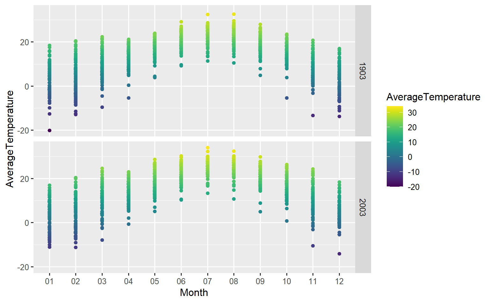
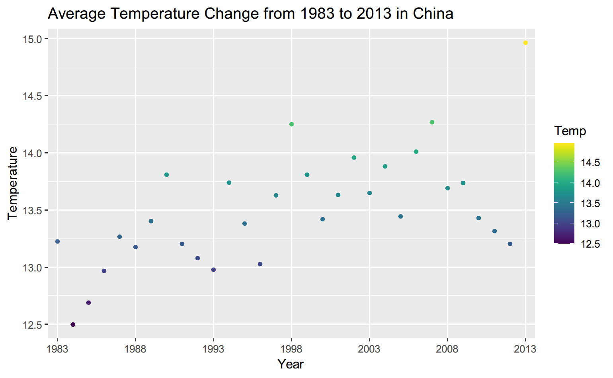
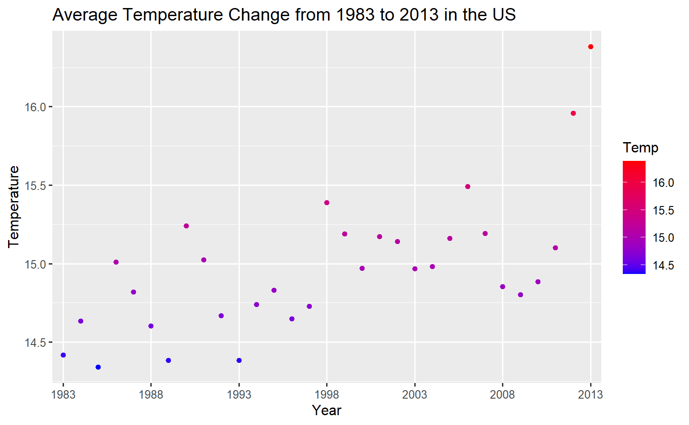
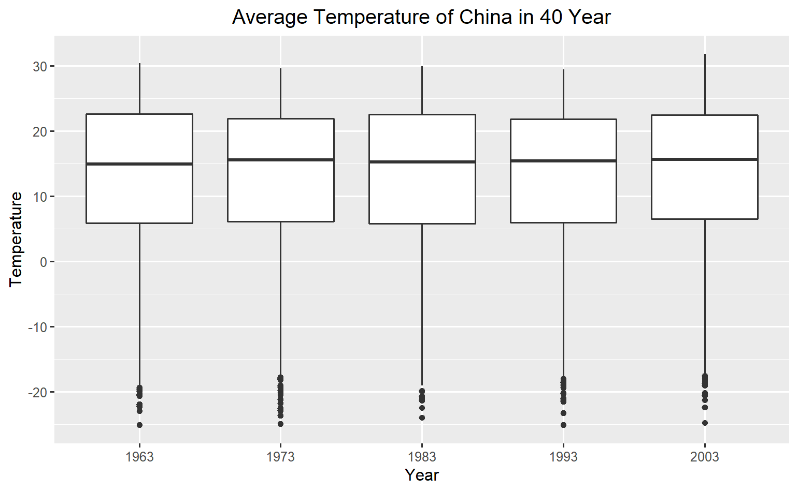
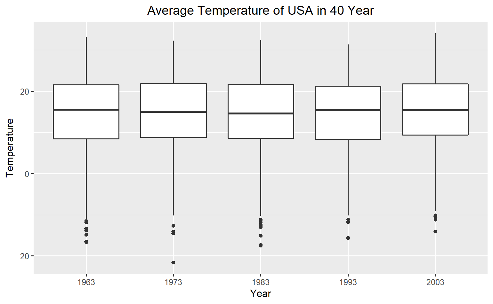
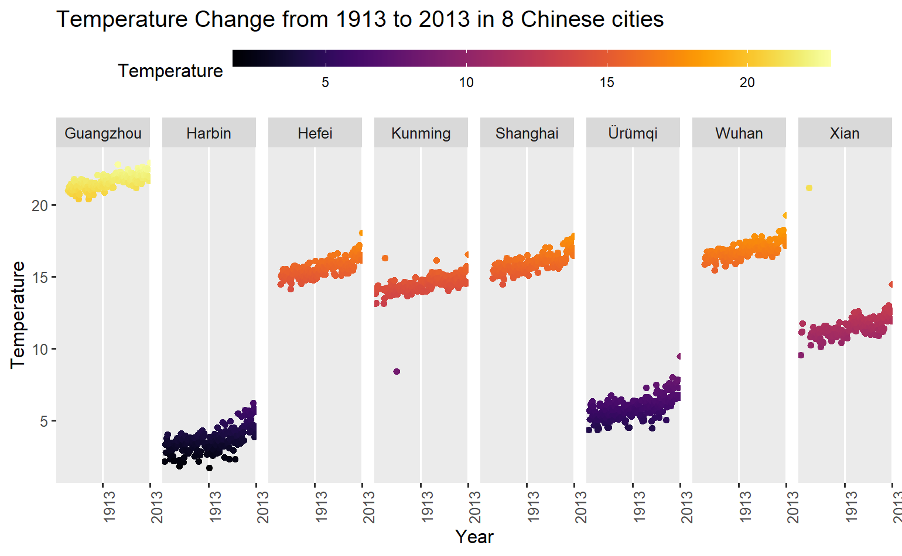
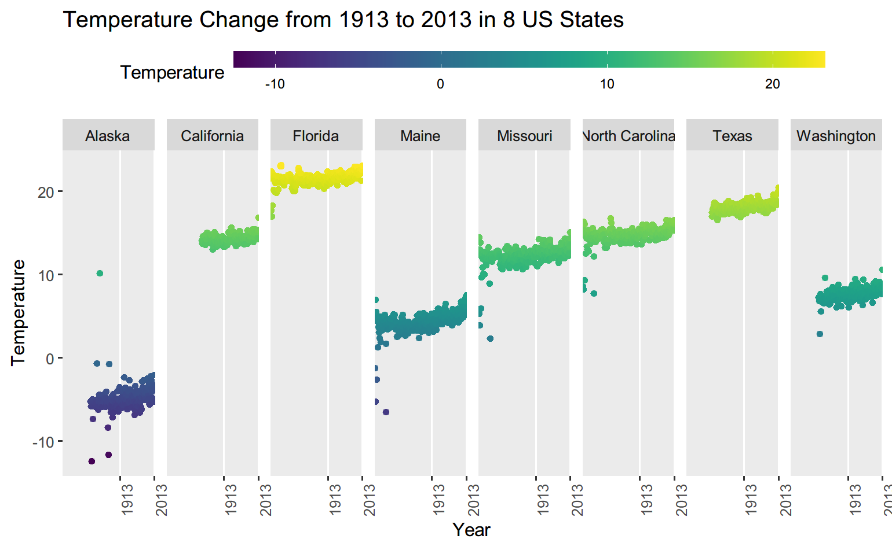

# Changes in Global Temperature

### Table of Contents

- [Changes in Global Temperature](#changes-in-global-temperature)
    - [Table of Contents](#table-of-contents)
    - [Introduction](#introduction)
    - [Global Map <a name="Global Map"></a>](#global-map-)
    - [Country Specific Analyses](#country-specific-analyses)
    - [Comparative Analyses (Countries) <a name="Comparative Changes (Countries)"></a>](#comparative-analyses-countries-)
    - [Comparative Analyses (Cities or States) <a name="Comparative Changes (Cities or States)"></a>](#comparative-analyses-cities-or-states-)
    - [Conclusions](#conclusions)
    - [Citation](#citation)

### Introduction

This project is brought to you by Group V. This website hosts graphs and maps that visually represent the changes in global temperature from 1743 to 2013. We seek to demonstrate the extent of global warming and illustrate the seriousness of that problem.

### Global Map <a name="Global Map"></a>

We plotted two global maps that describe the changes in temperatures of all countries in Celcius unit.

<iframe src="climate_change_map.html" height="600px" width="100%"></iframe>

Above is an interactive map that plots the differences in average temperatures of two period: 1743 to 1975 and 1975 to 2013.

We choose 1975 to be the threshhold because the idea of global warming was first coined in 1975.

As the map above shows, average global temperatures after 1975 are much higher in all countries than the average temperatures before 1975.

<iframe src="gganim.gif" height="600px" width="90%"></iframe>

The GIF above animatedly shows the changes in average temperatures. The legend in the bottom represents the differences of average temperature in one year compared to that of last year.

As it shows, temperatures of each country increase annually; in some countries, such as Canada, the extent of increasing temperatures are especially significant.

We also graphed a violin plot to reflect the average temperature of six continents even though the graph could not reflect the global warming issue.

However, for Africa, Oceania, and South America, we can assume they have the most negligible impact of global warming, or their temperature won't change a lot over seasonally.

On the contrary, Asia, Europe, and North America have various changes in average temperatures. Therefore, we aim to analyze countries in Asia, Europe, and North America in the following analysis.

<iframe src="Vio.html" height="600px" width="100%"></iframe>

### Country Specific Analyses

The following plot shows the changes in monthly average temperature from 1983 to 2013 for Russia. The red line is the monthly average temperature. The blue line indicates the fluctuating temperature difference between the current and previous months in last year.

<iframe src="Russia_1.html" height="600px" width="100%"></iframe>

We can see that there is a noticeable difference in 12-month periods. Closely looking at the 2016/1 and the 2017/1, there are the most significant temperature differences (9.715 degrees Celcius) over 30 years.

And there are obvious differences in the following dates compared to the same month in last year(temperature differences higher than absolute of 5 degrees)

```
1991-03-01
2006-01-01
1972-01-01
1987-11-01
1972-11-01
1982-01-01
1984-12-01
1998-04-01
2009-02-01


2007-01-01
1995-02-01
2003-12-01
2007-04-01
2000-03-01
1983-01-01
1989-02-01
```

The following plot is a similar plot for the U.S.

<iframe src="USA_1.html" height="600px" width="100%"></iframe>

The Monthly temperature plot in the USA has relatively smooth temperature differences compared to Russia. The largest temperature difference was 3.735 in 2013/3 and its previous 12 month period (2012/3).

The same plot for Singapore.

<iframe src="Singapore_1.html" height="600px" width="100%"></iframe>

Singapore has had a weakly increasing trend in average temperature over 30 years compared to Russia and the U.S. Since Singapore is located near the equator and has a tropical climate, the temperatures do not severely fluctuate over the seasons.

The following plots present annual changes in temperatures for Russia, the U.S., and China.

<iframe src="Russia_2.html" height="600px" width="100%"></iframe>

The increasing trends in average year temperature is conspicuous in the yearly plot for Russia. Temperature differences compared with last year change drastically. (Blue line)

For Russia, 1998 to 2003 was a turning point since the temperature increased more than two years.

From 2009 to 2013, there was a continuous increase in temperatures from -4.6 degrees to 2.2 degrees. Even though the temperatures fell back in 2012, the average temperature can not go back to the mean value of - 4.596 degrees.

<iframe src="USA_2.html" height="600px" width="100%"></iframe>
The increasing trends in average year temperature is also conspicuous in the yearly plot for the U.S.

From 1996 to 1998, temperatures in the U.S. increased continually.

From 2008 to 2013, there was a significant increase in temperatures from 8.95 degrees to 11.3 degrees.

<iframe src="CN_1.html" height="600px" width="100%"></iframe>

The average temperature of China is increasing as well since 1983.

From 1984 to 1990, the average temperature increases tremendously.

From 2012 to 2013, the temperature has an obvious increases(2.2)

### Comparative Analyses (Countries) <a name="Comparative Changes (Countries)"></a>

The following two plots are showing the Average temperature change in different months within cities of two different countries from year 1903~2003 (China & the U.S.).





For average temperature in 1903 in China, from June to August, the average temperature are the highest amoung other months throughout the year, and January and December got the lowest average temperaturse.

In 2003, the ranges of temperature in each months does not change too much and the average temperature raised a bit in July but not very much.

For average temperature in 1903 in the US, June and July got the highest average temperature which ranges from 15 to 26 degree. January got the lowest average temperature around -10 to 20 degree. In year 2003, the average temperature in the US raised a bit but not significant.

The following two plots are showing the average temperatures from year 1983 to 2013 in China and the U.S.





The average temperature plots of two countries both have an increasing trend from year 1984 to 2013 and reaches their perspective maximum average temperature at 2013: around 15 degrees in China and 16.7 degress in the U.S.

The following two boxplots are showing the average temperatures of the two countries (China and the U.S.) in forty years from 1963 to 2003.





From the plots, it can be seen that changes are not significant.

### Comparative Analyses (Cities or States) <a name="Comparative Changes (Cities or States)"></a>

The following two diagrams are showing eight cities in China and eight states in the U.S. We selected eight representative cities/states based on their unique locations to each perspective country.





Generally speaking, both cities in China and States in the US have an increasing trend of average temperature from 1913 to 2013. We selected representative cities that located in different direction of each country (South, North, center, near the ocean, etc).

### Conclusions

This project emphasizes the seriousness of global warming. Our plots clearly shows that temperatures are indeed rising continuously and steadily around the globe. This is the time that we must take actions to prevent global temperatures from further increasing.

Nevertheless, we have not gone into the causes of global warming. We have tried to find a relationship between Carbon dioxide emission and global warming, but this relationship is especially difficult to be visible on a graph. Therefore, finding the most significant causes of global warming. will be a direction for further research.

### Citation

Data used in this project are from Kaggle. Two Kaggle datasets have been used:

- [Map of temperatures and analysis of global warming](https://www.kaggle.com/code/amelinvladislav/map-of-temperatures-and-analysis-of-global-warming/data?select=GlobalLandTemperaturesByState.csv). This dataset is created by Vladislav Amelin on November 11, 2016.
- [Trends in global CO2 emissions](https://www.kaggle.com/code/fehmifratpolat/trends-in-global-co2-emissions/data). This dataset is created by Firat Polat on September 26, 2020.
